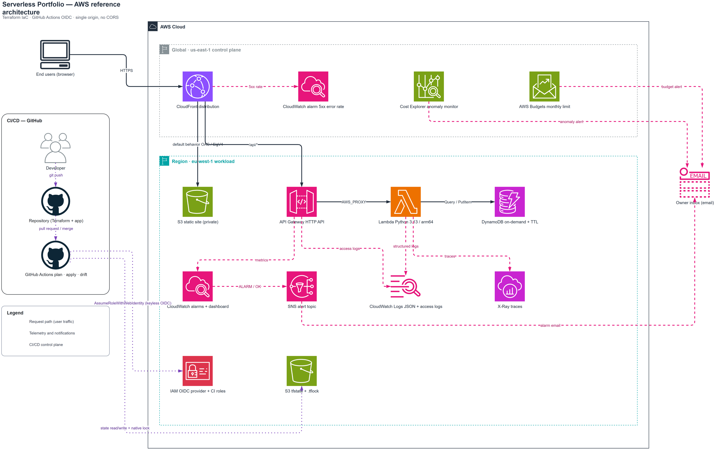
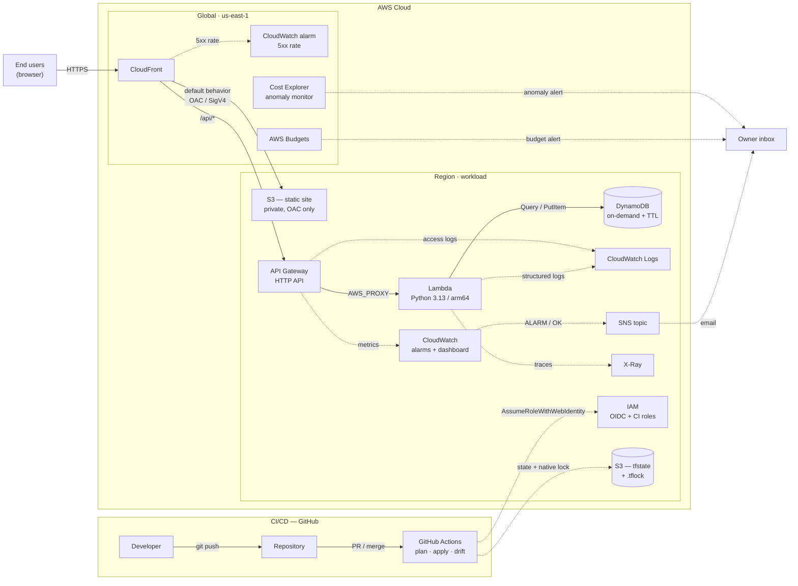

# AWS Serverless Portfolio

A production-shaped, cost-conscious AWS stack defined entirely in Terraform and
deployed by GitHub Actions with keyless OIDC authentication.

A static site on S3 and CloudFront, an HTTP API on Lambda and DynamoDB, and the
things that usually get skipped in a demo: least-privilege IAM, a separated
plan/apply trust boundary, alarms that actually fire, a budget that actually
warns you, mocked unit tests, security scanning, and drift detection.

**Idle cost: approximately USD 0.00/month.** See [docs/cost.md](docs/cost.md).

---

## Architecture

The icon-accurate diagram lives at
[`docs/diagrams/architecture.drawio`](docs/diagrams/architecture.drawio) — official
AWS architecture icons, the GitHub mark, region and cloud boundaries. Export it
to PNG and SVG with:

```bash
make diagram   # needs the draw.io desktop CLI; see docs/diagrams/README.md
```

<!-- After running `make diagram`, uncomment the line below to embed the export:

-->

The Mermaid version below is maintained alongside it and renders directly on
GitHub with no export step:



**The one idea worth stealing:** CloudFront has two origins. The default
behavior serves S3 over Origin Access Control; `/api/*` is forwarded to the HTTP
API. The browser only ever talks to one hostname, so every request is
same-origin and **there is no CORS configuration anywhere in this repository**
([ADR-0008](docs/adr/0008-cloudfront-single-origin.md)).

---

## What is in here

| Path | What it holds |
| --- | --- |
| `bootstrap/` | One-time, locally-applied stack: state bucket, GitHub OIDC provider, two CI roles |
| `terraform/` | The workload stack — the root module CI plans and applies |
| `modules/static_site/` | Private S3 bucket, CloudFront, OAC, security headers, dual origin |
| `modules/serverless_api/` | HTTP API, Lambda, DynamoDB, least-privilege IAM, access logs |
| `modules/observability/` | Alarms, dashboard, SNS topic and subscription |
| `modules/cost_guardrails/` | Monthly budget, Cost Explorer anomaly detection |
| `src/api/` | The Lambda handler — one file, no third-party dependencies |
| `src/frontend/` | The static site Terraform publishes to S3 |
| `docs/adr/` | Eight decision records covering every load-bearing choice |
| `docs/diagrams/` | draw.io source for the architecture diagram |
| `.github/workflows/` | `ci.yml` (no credentials), `terraform.yml` (OIDC), `drift.yml` (scheduled) |

---

## Quick start

### Prerequisites

| Tool | Version | Why |
| --- | --- | --- |
| Terraform | >= 1.10 | S3 native state locking (`use_lockfile`) |
| AWS CLI | v2 | Bootstrap and cache invalidation |
| An AWS account | — | With permission to create IAM roles, once |
| A GitHub repository | — | For the OIDC trust policy |

Optional: `tflint`, `checkov`, `trivy`, `pre-commit`, `terraform-docs`,
draw.io desktop.

### 1. Bootstrap the account (once, locally)

This is the only step that uses real credentials on a laptop. It creates the
state bucket, the GitHub OIDC provider and the two CI roles — after this,
nothing needs an AWS access key ever again.

```bash
cp bootstrap/terraform.tfvars.example bootstrap/terraform.tfvars
# edit github_owner and github_repository
./scripts/bootstrap.sh
```

The script prints the GitHub Actions repository variables to configure and
writes `terraform/backend.hcl` for you.

### 2. Configure GitHub

Under **Settings → Secrets and variables → Actions → Variables**:

| Variable | Value |
| --- | --- |
| `AWS_REGION` | Region from the bootstrap output |
| `AWS_PLAN_ROLE_ARN` | `plan_role_arn` output |
| `AWS_APPLY_ROLE_ARN` | `apply_role_arn` output |
| `TF_STATE_BUCKET` | `state_bucket_name` output |
| `TF_STATE_KEY` | `<project>/terraform.tfstate` |
| `ALERT_EMAIL` | Where alarms and budget warnings go |

Then under **Settings → Environments**, create `production` and add yourself as
a required reviewer. This is not optional: the apply role's trust policy only
accepts a token whose `sub` names that environment, and the reviewer requirement
is what turns it into an approval gate.

### 3. Deploy

```bash
cp terraform/terraform.tfvars.example terraform/terraform.tfvars
# set alert_email

make init
make plan
make apply
```

`terraform init` writes a `.terraform.lock.hcl` in each directory it touches.
**Commit those files.** They are what makes a CI plan byte-identical to a local
one; without them, CI silently resolves a different provider version.

```bash
git add '**/.terraform.lock.hcl' && git commit -m "chore: pin provider versions"
```

Or push to `main` and let CI do it. Either way:

```bash
make output
```

Open `site_url`. Confirm the SNS subscription email AWS sends you, or the alarms
will fire into the void.

---

## Day-to-day

```bash
make check       # fmt, validate, tflint, mocked unit tests, checkov, trivy
make plan        # plan the workload stack
make apply       # apply the plan you just reviewed
make invalidate  # bust the CloudFront cache
make destroy-plan # show exactly what a destroy would remove — always run first
make diagram     # re-export the architecture diagram
make help        # everything else
```

The API is a small message board:

```bash
SITE=$(terraform -chdir=terraform output -raw site_url)

curl "$SITE/api/health"
curl -X POST "$SITE/api/items" -H 'content-type: application/json' \
     -d '{"message":"hello from curl"}'
curl "$SITE/api/items?limit=10"
```

---

## How CI is wired

Three workflows, deliberately separated by what they are allowed to touch.

**`ci.yml`** — runs on every pull request. Format, validate, tflint, mocked
`terraform test`, Checkov, Trivy, and `ruff`/`mypy` on the handler. It has **no
`id-token` permission and no AWS credentials**, so a pull request from a fork
cannot reach the account no matter what it contains.

**`terraform.yml`** — plans on pull requests and applies from `main`.

```
PR opened ──► plan (read-only role) ──► plan posted as a PR comment
merge to main ──► plan ──► artifact ──► [production approval] ──► apply
```

The apply job applies **the saved plan artifact**, never a freshly computed one.
Re-planning inside the apply job would apply something nobody reviewed.

**`drift.yml`** — a scheduled `plan -detailed-exitcode` on weekday mornings. On
exit code 2 it opens or updates a GitHub issue with the diff. It never applies:
silently reconciling an out-of-band change is how a small mistake becomes an
outage.

---

## Testing

`terraform test` with `mock_provider "aws"` — 29 runs and 52 checks across four
modules, running on every pull request, creating nothing and costing nothing.

```bash
make test
```

The tests check the things a `plan` diff would not make obvious:

- every S3 public access block setting is on, and ownership is `BucketOwnerEnforced`
- the `/api/*` behavior uses `CachingDisabled` and `AllViewerExceptHostHeader`
- the Lambda timeout stays under the API Gateway integration limit
- reserved concurrency is set, so a spike cannot become an unbounded bill
- log retention is finite
- alarms treat missing data as `notBreaching` (serverless metrics are sparse; the
  default leaves alarms stuck in `INSUFFICIENT_DATA`)
- every alarm has an action — an alarm with no action is decoration
- the CloudFront alarm targets `Region = "Global"`, which is the only dimension
  value CloudFront publishes under
- variable validation rejects an unsupported architecture, an invalid retention
  period, an invalid email and a zero budget

---

## Security posture

- No AWS access key exists in this repository, in GitHub secrets, or on any
  machine. CI authenticates through OIDC with one-hour credentials
  ([ADR-0003](docs/adr/0003-github-oidc-over-static-keys.md)).
- The OIDC trust policies pin `aud` to `sts.amazonaws.com` and `sub` to this
  exact repository plus a branch or environment. No wildcards.
- Plan is read-only. Apply is a separate role, assumable only from the protected
  `production` environment, and explicitly denied permission to modify either CI
  role.
- The S3 origin bucket is private with all four public-access blocks on. The only
  reader is CloudFront over OAC, and the bucket policy pins
  `AWS:SourceArn` to that one distribution.
- The Lambda role grants `logs:CreateLogStream` and `logs:PutLogEvents` on its own
  log group only — not the `AWSLambdaBasicExecutionRole` managed policy, which
  grants them account-wide.
- Both S3 buckets deny non-TLS requests via bucket policy.
- CloudFront serves HSTS, CSP, `X-Content-Type-Options`, `frame-options: DENY` and
  a referrer policy on every response, including API responses.
- AWS errors are never returned verbatim to the caller — they leak table names,
  ARNs and the account ID.

Known gaps, each with a written justification, are in
[docs/security.md](docs/security.md). Nothing is suppressed in `.checkov.yaml` or
`.trivyignore` without an entry there.

---

## Documentation

| Document | What it answers |
| --- | --- |
| [docs/architecture.md](docs/architecture.md) | How a request flows, and what each component is for |
| [docs/adr/](docs/adr/README.md) | Why each decision was made, and what was rejected |
| [docs/runbook.md](docs/runbook.md) | Deploy, roll back, unstick a lock, respond to each alarm |
| [docs/cost.md](docs/cost.md) | Line-by-line cost model and the four cost controls |
| [docs/security.md](docs/security.md) | Threat model, IAM design, and every accepted gap |
| [CONTRIBUTING.md](CONTRIBUTING.md) | Conventions, local checks, pull request expectations |

---

## Tearing it down

```bash
make destroy-plan   # review every resource that will be deleted
make destroy
```

The bootstrap stack is separate and its state bucket carries `prevent_destroy`.
Removing it means editing that lifecycle block deliberately, which is the point.

---

## License

[MIT](LICENSE)
